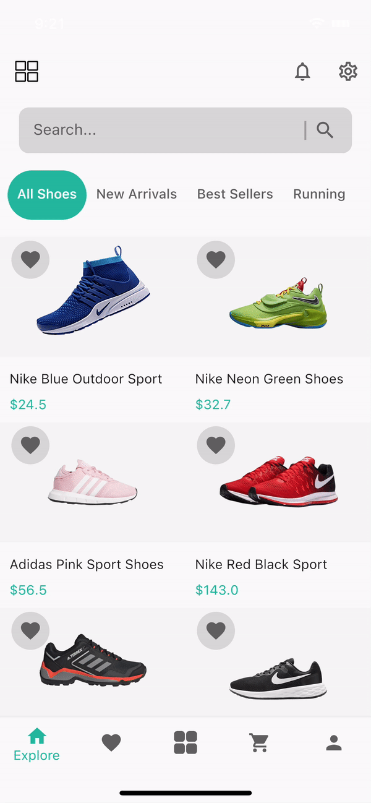

# Shoe Store UI

On the fourth day, I've done this Shoes Store UI by [@byrktrdesign](https://www.instagram.com/byrktrdesign/).

## 🦄 Design 
Here's the original design:

On this series, till the fourth day! This is the best UI I'm came across with! 🔥

## 🦄 Results

And again, we have two Screens today, Home and Details page! The code for each screens can be found in the `screes/` directory. For a change, I wanted to show the gif of the results today! The animations looks nicer than I expected.

&nbsp;&nbsp;&nbsp;&nbsp;&nbsp;&nbsp;&nbsp;

## 💬 Note
The release build for Android (apk) is available on the Release tab.
 

## 🛸 Credits
- Complete UI is done by [@byrktrdesign](https://www.instagram.com/byrktrdesign/).
- The Apps Icon [filled](https://www.flaticon.com/premium-icon/menu_4315568?term=apps%20square&page=1&position=47&page=1&position=47&related_id=4315568&origin=search) and [outlined](https://www.flaticon.com/free-icon/mobile-app_73719?term=apps%20squares&page=1&position=30&page=1&position=30&related_id=73719&origin=search) is from Freepik

## 🌚 Contact 

You can connect me on [Telegram](https://t.me/heysreelal) all the time or on [Twitter](https://twitter.com/HeySreelal) or [Instagram](https://instagram.com/heysreelal).

I always prefer Telegram over Instagram or Twitter. I'm always open to new ideas and suggestions. 🦄

# Thank You ❤️
Show your support by sharing or starring the repo. ⭐️
